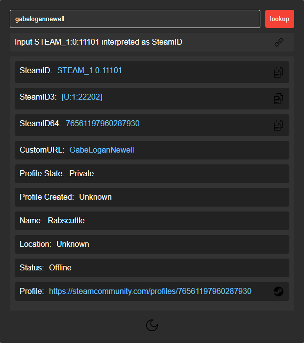

## SteamID Lookup
  
\
Simple frontend for querying SteamID information using [xpaw/SteamID.php](https://github.com/xPaw/SteamID.php)

## Requirements
- [Docker](https://docs.docker.com/engine/install/)  
- [Steam Web API Key](https://steamcommunity.com/dev)  

## Quickstart
```
docker run -d \
  --name=steamid-lookup \
  -e TZ="UTC" \
  -e STEAM_API_KEY="" \
  -p 8080:80 \
  --restart unless-stopped \
  ghcr.io/mistercalvin/steamid-lookup:latest
  ```

## Notes
### What works
- Inputting a SteamID, SteamID3, SteamID64, or CustomURL will return user details
- Dark / Light mode toggle

### What does not work
- Direct link to SteamID does nothing (will load main page only)
- No API currently in place
- Some user locations will show up incorrectly
- Redis support not functional

## Current credits
[xPaw/SourceQuery](https://github.com/xPaw/PHP-Source-Query) - PHP Source Query class  
[TrafeX/docker-php-nginx](https://github.com/TrafeX/docker-php-nginx) - tiny NGINX 1.24/PHP-FPM 8.3 Dockerfile 
[NginxProxyManager/nginx-proxy-manager](https://github.com/NginxProxyManager/nginx-proxy-manager) - [block-exploits.conf](docker/nginx/config/conf.d/include/block-exploits.conf)  
[https://www.svgrepo.com/](https://www.svgrepo.com/) - icons  
[steamid.io](https://steamid.io/lookup) - influenced UI
